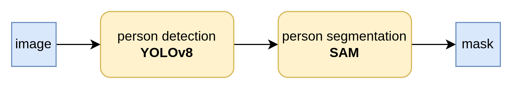

# 📸 Photo Augmentation
This is a demo project for augmenting people in images using state-of-the-art computer vision and generative AI models.

## ✅ Prerequisites
Docker (for containerized deployment)

NVIDIA GPU with CUDA 11.7+ (recommended for optimal performance)

Python 3.10+ (required for local development using Poetry)

### 📥 Downloading Models
Before running the Docker container, you must download the necessary deep learning model weights and store them in the models directory.

First we create a `models` directory that will be mounted in docker container.
```bash
mkdir models
```

Now we can download model weights. For this project the following have been tested.

```bash
wget https://dl.fbaipublicfiles.com/segment_anything/sam_vit_b_01ec64.pth -O ./models/sam_vit_b_01ec64.pth
```

```bash
wget https://huggingface.co/Ultralytics/YOLOv8/resolve/main/yolov8n.pt -O ./models/yolov8n.pt
```

```bash
wget https://huggingface.co/runwayml/stable-diffusion-v1-5/resolve/main/v1-5-pruned.safetensors -O ./models/v1-5-pruned.safetensors
```

### 🗃️ Request Logging
All API requests are logged using TinyDB. Create an empty directory on your host system that will be mounted into the Docker container to persist these logs.

```bash
mkdir tiny_db
```

## 🚀 Installation
### Option 1: Docker Compose (Recommended)
```bash
docker-compose up --build
```

You can adjust the default mount points for the models and `tiny_db` directories inside the `docker-compose.yml` file.

### Option 2: Docker (Manual)

Build Docker image:
```bash
docker build -t photo-augmentation .
```

Run the container with GPU support:
```bash
docker run --gpus all -p 8000:8000 -v $(pwd)/models:/app/models -v $(pwd)/tiny_db:/app/tiny_db photo_augmentation 
```

The API will be accessible at http://localhost:8000.

### Option 3: Poetry (Development)
This method is intended for local development. We use `Poetry` for dependency management.

Create and install a package in a virtual environment:
```bash
poetry install
```

Activate environment:
```bash
eval $(poetry env activate)
```

Export dependencies to `requirements.txt`:
```bash
poetry export  --format=requirements.txt > requirements.txt 
```
Rebuild the Docker image after updating dependencies.

Start the FastAPI server:
```bash
uvicorn main:app --reload --host 0.0.0.0 --port 8000
```

## 🧠 Models Used
This project integrates four core deep learning models, organized into multiple processing pipelines exposed via FastAPI endpoints.

### YOLOv8
* YOLOv8 is a real-time object detection model that accurately identifies and localizes objects in images.
* Used for detecting people in input images.

### SAM (Segment Anything Model)
* SAM is a foundational segmentation model capable of generating high-precision masks for any object in an image with minimal prompting.
* Used to segment people based on YOLOv8 detections.

### Stable Diffusion
* Stable Diffusion is a generative model that synthesizes high-quality images from textual prompts using latent diffusion.
* Used for generating new people from text or image prompts.

### Stable Diffusion Inpainting
* This variant of Stable Diffusion enables inpainting—filling or editing masked regions of an image using prompt guidance.
* Used for replacing or blending in people seamlessly within an image.


## Endpoints
Four main endpoints are the following.

### 1. Person Segmentation
Detects and segments people in an image, returning mask outlines.



### 2. Generate Person
Generates a new person using a combination of image and text prompts.


### 3. Inpaint Masked Region
Fills in masked regions of an image using Stable Diffusion Inpainting.


### 4. Person Swap
Swaps a detected person in the image with a newly generated person.


### 5. Person Injection
Injects a new person into a group photo at a contextually appropriate location.


## 🧱 Architecture
The project is structured as a Python package named photo_augmentation, which encapsulates all model logic and utility methods.

* The FastAPI framework is used for exposing the model pipelines via RESTful endpoints.
* TinyDB is integrated to log requests and responses for auditing and analysis.
* The entire application is containerized using Docker, with optional orchestration via Docker Compose for easy integration into broader systems.


